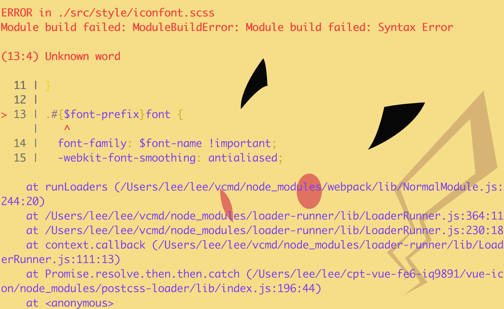

# Module build failed: ModuleBuildError: Module build failed: Syntax Error (13:4) Unknown word

最近配置 webpack 4 的时候遇到一个经典的问题困扰我一天，关键词 `Unknown word` 。

## 操作环境

- 开发环境： OS X El Capitan 10.11.6
- 开发工具： [Atom](https://atom.io)
- node: v9.11.1
- npm: 5.0.3
- webpack: 4.5.0
- postcss-loader: 2.1.3
- css-loader: 0.28.11
- node-sass: 4.8.3
- sass-loader: 7.0.1

## 报错信息⤵️

```
ERROR in ./src/style/iconfont.scss
Module build failed: ModuleBuildError: Module build failed: Syntax Error

(13:4) Unknown word

  11 | }
  12 |
> 13 | .#{$font-prefix}font {
     |    ^
  14 |   font-family: $font-name !important;
  15 |   -webkit-font-smoothing: antialiased;

    at runLoaders (/Users/lee/lee/vcmd/node_modules/webpack/lib/NormalModule.js:244:20)
    at /Users/lee/lee/vcmd/node_modules/loader-runner/lib/LoaderRunner.js:364:11
    at /Users/lee/lee/vcmd/node_modules/loader-runner/lib/LoaderRunner.js:230:18
    at context.callback (/Users/lee/lee/vcmd/node_modules/loader-runner/lib/LoaderRunner.js:111:13)
    at Promise.resolve.then.then.catch (/Users/lee/lee/cpt-vue-fe6-iq9891/vue-icon/node_modules/postcss-loader/lib/index.js:196:44)
    at <anonymous>
 @ ./src/style/index.ts 1:0-25
```


## 解决方案

从上面报错得知是有关样式编译的时候报错的，所以主要检查一下关于样式打包的情况。 **有可能 postcss 解析不了 sass 的语法** 。

> 代码来自 webpack 4 配置文件的 module 部分。 MiniCssExtractPlugin 是提炼样式的组件 [mini-css-extract-plugin](https://github.com/webpack-contrib/mini-css-extract-plugin) 。 `resolve` 是获取文件的路径。

### 解决之前

```
module: {
  rules: [
    {
      test: /.scss$/,
      use: [
        MiniCssExtractPlugin.loader,
        'cache', 'css', 'sass', {
          loader: 'postcss',
          options: {
            config: {
              path: resolve('.postcssrc.js')
            }
          }
        },
      ]
    },
  ]
}
```

### 解决之后

```
module: {
  rules: [
    {
      test: /.scss$/,
      use: [
        MiniCssExtractPlugin.loader,
        'cache', 'css', {
          loader: 'postcss',
          options: {
            config: {
              path: resolve('.postcssrc.js')
            }
          }
        }, 'sass',
      ]
    },
  ]
}
```

## 源码

更全的配置，请移步 [76445c0](https://github.com/fe6/vcmd/commit/76445c0a232097fb47d4d9612b2dcda08777aca4) 。
