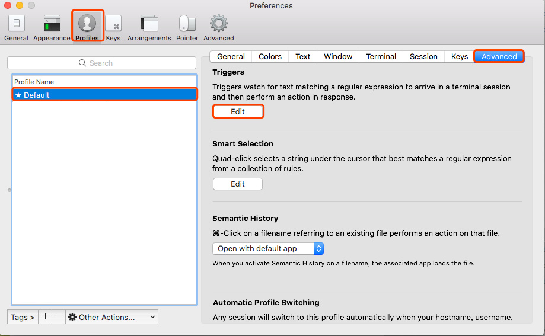

# iTerm2 使用 lrzsz 上传下载文件

## 安装
> 需要提前安装 Iterm2 和 Homebrew

```
# 本地 Mac 安装
brew install lrzsz

# 远程服务器安装
yum install -y lrzsz
apt-get install lrzsz
```

## 配置

1. 下载触发脚本
> 将他们拷贝到/usr/local/bin文件夹中

```
sudo su

wget https://raw.githubusercontent.com/iq9891/blog/master/assets/mac/iterm2-send-zmodem.sh
wget https://raw.githubusercontent.com/iq9891/blog/master/assets/mac/iterm2-recv-zmodem.sh

mv iterm2-send-zmodem.sh /usr/local/bin
mv iterm2-recv-zmodem.sh /usr/local/bin

chmod 777 /usr/local/bin/iterm2-*
```

2. 在iTerm 2添加Triggers




上图每栏的配置具体如下： 

```
# 第一条
Regular expression: rz waiting to receive.\*\*B0100
Action: Run Silent Coprocess
Parameters: /usr/local/bin/iterm2-send-zmodem.sh
Instant: checked

# 第二条
Regular expression: \*\*B00000000000000
Action: Run Silent Coprocess
Parameters: /usr/local/bin/iterm2-recv-zmodem.sh
Instant: checked
```

## 应用

1. 登录远程服务器
> expect is the reason why lrzsz can't be used.
If you don't use expect for ssh auto-logging, the lrzsz works.

```
# ❗️不能使用expect 来实现ssh 自动登录, 需要手工登录或者 so 来登录

ssh root@XXX.XXX.XXX.XXX -p 9922
```

2. 上传文件至远程服务器


- 在远程服务器执行 `rz` 命令
- 在弹窗中选择文件上传即可

3. 下载远程服务器的文件至本地


- 在远程服务器执行 `sz filename` 命令(将 filename 下载到本地)
- 在弹窗中选择要下载到本地的目录